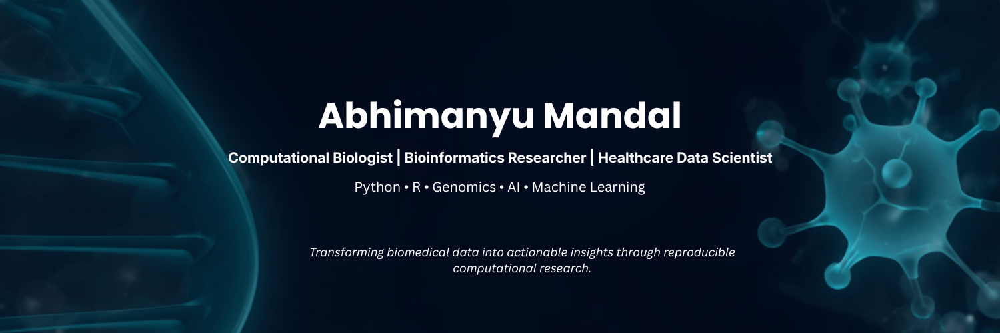

  

<h1 align="center">Hi, I'm Abhimanyu Mandal 👋</h1>

<h3 align="center">
Computational Biologist • Bioinformatics Researcher • Healthcare Data Scientist
</h3>

Building reproducible computational methods for genomics, precision medicine, and healthcare analytics.

Passionate about translating complex biomedical data into clinically meaningful insights using bioinformatics, machine learning, and statistical modeling.

---

# 👨‍🔬 About Me

I am a **Computational Biologist** with an integrated **B.Tech + M.Tech in Pharmaceutical Engineering & Technology** from **IIT (BHU), Varanasi**.

I develop computational pipelines that transform complex biomedical and healthcare data into meaningful biological and clinical insights through **bioinformatics, machine learning, statistics, and data visualization**.

My work spans **genomics, transcriptomics, infectious disease modeling, healthcare analytics, and AI-driven biomedical research**, with a strong focus on reproducible and scalable computational workflows.

---

# 🚀 Quick Facts

🎓 Integrated B.Tech + M.Tech — IIT (BHU), Varanasi

🔬 Former Project Research Assistant — IIT Bombay

🇨🇦 Former Mitacs Globalink Research Intern — Western University, Canada

🧬 Interested in Computational Biology, Cancer Genomics & Precision Medicine

📍 Bangalore, India

💼 Open to Full-Time Opportunities

---

# 🔬 Research Interests

- Computational Biology
- Bioinformatics
- Cancer Genomics
- RNA-seq Analysis
- Single-cell RNA Sequencing
- Clinical Genomics
- Precision Medicine
- Infectious Disease Analytics
- Machine Learning for Healthcare
- AI in Biomedical Research

---

# 💻 Technical Skills

### Programming Languages

| Domain | Technologies |
|---------|--------------|
| **Bioinformatics** | Seurat • DESeq2 • GATK • STAR • Cell Ranger • IGV |
| **Workflow Management** | Nextflow • Snakemake • Docker • Git|
| **Machine Learning** | Scikit-learn • Statistical Modeling |
| **Visualization** | Tableau • ggplot2 • Plotly • Matplotlib • R shiny|
| **Databases** | ClinVar • gnomAD • TCGA |

---

# ⭐ Featured Projects

## 🧬 Germline Variant Analysis Pipeline

**Python • GATK • Variant Annotation • Clinical Genomics**

Developed a reproducible germline variant analysis pipeline for processing next-generation sequencing data, including variant calling, annotation, filtering, and interpretation using clinically relevant genomic databases.

🔗 

---

## 🎗 Breast Cancer scRNA-seq Analysis

**R • Seurat • Single-cell Transcriptomics**

Performed single-cell RNA sequencing analysis to characterize tumor heterogeneity, identify marker genes, and investigate the tumor microenvironment. Developed computational workflows integrating transcriptomics and pathway analysis to prioritize therapeutic candidates for breast cancer.

🔗 

---

## 🦠 Tuberculosis Spatial Risk Modeling

**R • Bayesian Statistics • Spatial Epidemiology**

Developed Bayesian disease mapping models to identify tuberculosis hotspots and quantify spatial risk patterns for public health decision-making.

🔗

---

## 🧠 Neurotoxicity Prediction using Machine Learning

**Python • Scikit-learn • Support Vector Machine (SVM) • Feature Engineering**

Developed and evaluated machine learning models to predict neurotoxicity risk from biomedical data. Optimized feature engineering and model performance, achieving **83% classification accuracy** using a Support Vector Machine (SVM), demonstrating the application of AI to predictive toxicology.

🔗

---

## 🏥 Healthcare Claims Analytics

**R • Tableau**

Developed an end-to-end healthcare analytics platform for insurance claims analysis, fraud detection, settlement efficiency, and provider performance evaluation.

🔗 

📈 

---

# 💼 Research Experience

### 🔬 Project Research Assistant | IIT Bombay

- Developed Bayesian spatial disease mapping models to identify tuberculosis hotspots.
- Integrated epidemiological, demographic, and geospatial datasets for public health analysis.
- Applied statistical modeling to support evidence-based disease surveillance.

---

### 🇨🇦 Mitacs Globalink Research Intern | Western University

- Developed computational workflows for breast cancer drug repurposing.
- Analyzed single-cell RNA sequencing datasets using Seurat.
- Performed transcriptomic and pathway analyses to identify therapeutic targets.

---

# 🌱 Currently Working On

- 🧬 RNA-seq Analysis Pipelines
- 🤖 Machine Learning for Precision Medicine
- 📊 Healthcare Data Analytics
- 🧠 AI Applications in Computational Biology
- 📦 Reproducible Bioinformatics Workflows

---

# 🤝 Let's Connect

<a href="https://abhimanyumandal.github.io/Personal-Portfolio/#">
Portfolio
</a>
&nbsp;&nbsp;•&nbsp;&nbsp;

<a href="https://www.linkedin.com/in/abhimanyu-mandal/">
LinkedIn
</a>
&nbsp;&nbsp;•&nbsp;&nbsp;

<a href="mailto:abhimanyumandal0810@gmail.com">
Email
</a>

---

<i>
"Transforming biomedical data into actionable insights through reproducible computational research."
</i>

